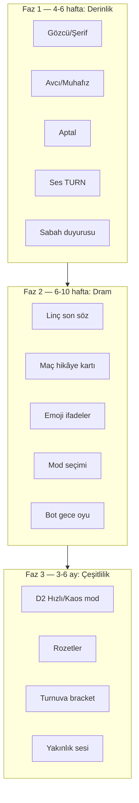

# Vampir Köylü — Oyun Geliştirme Planı (İlgi & Zevk)

**Sürüm:** 1.0  
**Tarih:** Mayıs 2026  
**Amaç:** Oyuncunun **“bir el daha”** demesini sağlayan özellikler — dram, sürpriz, sosyal an, rol hissi.  
**İlişkili:** [PLAN-TUTMA-REKABET.md](./PLAN-TUTMA-REKABET.md) (tutma/lig), [PLAN-PROFIL-UX.md](./PLAN-PROFIL-UX.md), [PLAYSTORE-HAZIRLIK-PLANI-v0.2.32.md](./PLAYSTORE-HAZIRLIK-PLANI-v0.2.32.md)

---

## 0. Şimdiki oyun — dürüst fotoğraf

### Güçlü yanlar (korunmalı)
| Alan | Durum |
|------|--------|
| Online 4–8 kişi, sunucu otoriter | Çalışıyor |
| Gece / gündüz / oylama döngüsü | Çalışıyor |
| Sohbet kanalları (canlı, ölü, vampir gece) | Çalışıyor |
| Sesli sohbet (WebRTC + mikrofon) | Altyapı var, TURN/test gerekli |
| Rol açılışı, faz banner, maç özeti, MVP | Var |
| Bot doldurma, hızlı maç, bot sohbet | Var |
| Profil, rütbe, kozmetik, görev, turnuva iskeleti | Var |
| Arkadaş daveti, genel sohbet | Var |

### Zayıf yanlar (zevk düşürüyor)
| Sorun | Etki |
|--------|------|
| **12 rolden 3’ü oynanıyor** (vampir öldür, doktor koru, oyla) | “Aynı oyun” hissi, rol heyecanı yok |
| Gözcü/şerif bilgisi, avcı intikamı, aptal zaferi yok | Tasarım vaadi tutulmuyor |
| Gece fazı kısa / pasif (çoğu oyuncu bekliyor) | Sıkıcı tur |
| Ses bazen bağlanmıyor (NAT, TURN) | Sosyal oyun yarım kalıy |
| Orta maç kopunca geri dönüş zor | Maç çöpe gidiyor |
| Turnuva tek maç, bracket yok | Rekabet derinliği az |
| Botlar oyuncu gibi oynamıyor (sadece sohbet) | Yalnız oynayan için yapay |

**Özet:** İskelet iyi; **oyun derinliği ve “wow anları”** eksik. Plan önce derinliği, sonra sürprizi ve sosyal dramayı büyütür.

---

## 1. Zevk için dört sütun

Bu türde oyuncu şunlar için gelir:

```
1. DRAM     → “Kim yalan söyledi?” “Bu gece kimi öldürdüler?”
2. GÜÇ      → “Rolüm işe yaradı” (doktor kurtardı, gözcü buldu)
3. SOSYAL   → Ses + sohbet + arkadaşla aynı masada gülme/kavga
4. SÜRPRİZ  → Mod, etkinlik, beklenmedik sonuç (aptal kazandı)
```

Her özellik bu dört sütundan en az birine hizmet etmeli; sadece “menüde yeni buton” yetmez.

---

## 2. Önerilen özellikler (öncelik sırası)

### A. Oyun derinliği — “Rol oyunu gerçekten rol oyunu” (P0)

| # | Özellik | Oyuncu ne hisseder | Teknik |
|---|---------|-------------------|--------|
| A1 | **Gözcü / şerif araştırma** | Gece birini seç → “iyi / kötü / belirsiz” ipucu (sadece ona) | `investigate` in `gameAction`, `playerView` gizli sonuç |
| A2 | **Avcı tuzak** | Öldürülürse saldırgana geri vuruş | `trap` on death in `resolveNight` |
| A3 | **Muhafız** | Bir gece birini blok (ölüm yok) | `guard` action |
| A4 | **Aptal (fool)** | Yanlışlıkla linçlenirse tek başına kazanır | `checkWinner` + özel özet ekranı |
| A5 | **Çift ajan** | “Kandırma” gece aksiyonu + görev metriği | `deceive` UI + `matchLog` |
| A6 | **Sessiz katil** | İkinci öldürme veya farklı hedef kuralı (6+ kişi) | Rol varyantı `resolveNight` |
| A7 | **Gece sırası UI** | “Sıra sende” / “Bekle” — pasif oyuncu bilir | Faz alt metni + timer |

**Zevk etkisi:** Her maç farklı hikâye; “doktor oldum korudum” anı paylaşılabilir.

---

### B. Dram ve gerilim — “Masa kaynıyor” (P1)

| # | Özellik | Oyuncu ne hisseder | Teknik |
|---|---------|-------------------|--------|
| B1 | **Sabah duyurusu** | “Gece X öldü” / “Kimse ölmedi” animasyonlu banner | `resolveNight` → `room:state` + ses efekti |
| B2 | **Linç anı** | Oylanan kişi + kısa “son söz” (15 sn opsiyonel metin) | `resolveDay` öncesi mini faz |
| B3 | **Ölü sohbet + hayalet ipucu** | Ölüler konuşur; 1 kez “şüpheli X” ipucu (kontrollü, abuse önlemli) | `dead:CODE` + rate limit |
| B4 | **Gizli oy** | Gündüz “en şüpheli” anonim oylama (linçten önce gerilim) | Ek oylama turu veya UI anket |
| B5 | **Maç sonu hikâye kartı** | Öldürmeler, en çok suçlanan, MVP — paylaşılabilir görsel | `match_summary_screen` zenginleştir |
| B6 | **Rol reveal (sadece ölenler / oyun sonu)** | “O aslında vampirdi!” şoku | `gameOver` full role list |

**Zevk etkisi:** Twitch/Discord’da anlatılacak anlar; screenshot paylaşımı.

---

### C. Sosyal & ses — “Arkadaşlarla oynamaya değer” (P1)

| # | Özellik | Oyuncu ne hisseder | Teknik |
|---|---------|-------------------|--------|
| C1 | **Ses stabil (TURN prod)** | 4G/Wi‑Fi’de gerçekten duyuluyor | VPS TURN + test |
| C2 | **Yakınlık sesi** | Masada “yanındakiler” daha net (oyun odasında) | Proximity channel veya mesafe simülasyonu |
| C3 | **Hızlı ifadeler** | “Şüpheli”, “Güveniyorum”, “Sus” emoji/chip | Oda sohbetine preset |
| C4 | **Arkadaşla özel oda** | Tek tık “arkadaşları davet et” + hazır oda | Mevcut invite + UX |
| C5 | **Ölüler tribün modu** | Elendi, maçı izlemeye devam (sadece dead chat + skor) | Spectator flag |
| C6 | **Ses durumu göstergesi** | Kim konuşuyor / mic kapalı | UI strip |

**Zevk etkisi:** Parti oyunu hissi; ses çalışınca retention patlar.

---

### D. Modlar & çeşitlilik — “Her gün farklı bir şey” (P2)

| # | Özellik | Açıklama |
|---|---------|----------|
| D1 | **Klasik mod** | Mevcut kurallar (varsayılan) |
| D2 | **Hızlı mod** | 5 dk gece, 3 dk gündüz — tempo |
| D3 | **Kaos mod** | 8 kişide garanti 2 vampir + aptal |
| D4 | **Sade mod** | 4–5 kişi, sadece vampir + köylü + doktor (yeni oyuncu) |
| D5 | **Haftalık etkinlik modu** | “Bu hafta: çift gece öldürme” sunucu flag |
| D6 | **Özel oda ayarları** | Host: gece süresi, bot zorluğu, rol havuzu |

**Zevk etkisi:** “Bu akşam kaos atalım” — tekrar oynama nedeni.

---

### E. Bot & yalnız oyuncu — “Kimse yokken de eğlence” (P2)

| # | Özellik | Açıklama |
|---|---------|----------|
| E1 | Bot gece oyu (basit hedef seçimi) | Boş slotlar oyunu bitirmesin |
| E2 | Bot gündüz oyu | Rastgele veya “en çok konuşan”a oy |
| E3 | Bot zorluk (easy/normal/hard) | Hard: daha agresif vampir oyu |
| E4 | Solo mod ilerleme | Offline’a sınırlı XP/coin teşviki (kayıt ol) |
| E5 | Bot kişilik (nick + avatar + kısa replik) | Masada “insan gibi” his |

---

### F. İlerleme & koleksiyon — “Oynamaya değer” (P2–P3)

| # | Özellik | Zevk (P2W yok) |
|---|---------|----------------|
| F1 | **Rol rozetleri** | “10 kez doktor ile kazandın” profilde |
| F2 | **Maç kartı koleksiyonu** | Nadir “efsane maç” kartı (MVP + 8 kişi) |
| F3 | **Sezon teması** | Aylık kozmetik + arka plan teması |
| F4 | **Başarılar** | İlk vampir zaferi, 5 gece koruma, vb. |
| F5 | **Kozmetik maç içi** | Ölüm animasyonu, çerçeve — zaten kısmen var, vitrin güçlendir |

---

### G. Rekabet & topluluk — “Ciddi oyuncu da kalsın” (P3)

| # | Özellik | Not |
|---|---------|-----|
| G1 | Lig / ELO | [PLAN-TUTMA-REKABET](./PLAN-TUTMA-REKABET.md) |
| G2 | Turnuva bracket | 8 kişi eleme |
| G3 | Liderlik + arkadaş sıralaması | Sosyal rekabet |
| G4 | Canlı etkinlik (Cuma kupası) | Push + ödül |
| G5 | İçerik oylaması | “Sonraki rol hangisi?” topluluk |

---

## 3. Yol haritası (fazlar)



### Faz 1 — “Artık rol oyunu” (en yüksek zevk/effort oranı)
- A1–A5 (gözcü, avcı, muhafız, aptal, çift ajan UI)
- C1 ses prod
- B1 sabah duyurusu + kısa ses
- **Çıktı:** Oyuncu “farklı rol denemek istiyorum” der

### Faz 2 — “Masa dramı”
- B2, B5, B6 maç sonu
- C3 hızlı ifadeler
- D1 mod seçici (en az Klasik + Hızlı)
- E1 bot gece/gündüz oyu
- **Çıktı:** Maç sonu ekran görüntüsü paylaşımı

### Faz 3 — “Uzun vadeli bağlılık”
- Mod paketi (Kaos, Sade)
- Rozet + başarı
- Turnuva bracket
- Haftalık etkinlik
- **Çıktı:** Topluluk ve tekrarlayan etkinlik

---

## 4. Hızlı kazanımlar (1–2 sprint, düşük efor)

Büyük kod yazmadan zevki artırır:

| Özellik | Efor | Etki |
|---------|------|------|
| Gece/gündüz **geri sayım** görünür | Düşük | Gerilim |
| Ölümde **kısa titreşim + ses** | Düşük | Dram |
| Maç sonunda **“Tekrar oyna”** aynı oda | Orta | Tekrar |
| Lobide **“Son oynadıklarınla davet”** | Orta | Sosyal |
| Görev metinlerini **rol hikâyesi** ile yaz | Düşük | Bağlama |
| Bot **daha fazla lobi replik** | Düşük | Canlılık |
| **Host: gece süresi** slider (60–120 sn) | Orta | Özelleştirme |

---

## 5. Kaçınılacaklar (zevk düşürür)

- Pay-to-win rol veya gece gücü satışı
- Çok uzun zorunlu tur (mobilde sıkılma)
- Ölülere aşırı bilgi (oyun çözülür)
- Spam sohbet cezasız (toxic)
- Her güncellemede zorunlu APK (Play Store’da In-App Update)

---

## 6. Başarı ölçütleri (zevk odaklı)

| Metrik | Hedef | Anlamı |
|--------|-------|--------|
| Maç tamamlama oranı | > %75 | Oyun bitiyor, çökmüyor |
| Aynı gün 2+ maç | > %30 aktif | “Bir el daha” |
| Ses kanalına katılım | > %50 maç | Sosyal |
| Farklı rol oynama (7 gün) | ≥ 3 rol | Çeşitlilik |
| Maç sonu ekranda kalma | > 15 sn | Özet izleniyor |
| Arkadaşlı maç | > %40 | Parti oyunu |

---

## 7. Önerilen sıradaki sürümler

| Sürüm | Odak | Örnek maddeler |
|-------|------|----------------|
| **v0.2.33** | Rol derinliği 1 | Gözcü, avcı, gece UI |
| **v0.2.34** | Dram | Sabah duyurusu, linç anı, ses efektleri |
| **v0.2.35** | Sosyal | Emoji ifadeler, ses iyileştirme, reconnect |
| **v0.2.36** | Modlar | Hızlı mod, host ayarları |
| **v0.3.0** | Play + topluluk | Store, bracket, rozetler |

---

## 8. Tek cümlelik vizyon

**“Her el farklı bir hikâye: rolün işe yarıyor, masa bağırıyor, sabah şok oluyorsun — arkadaşınla bir el daha.”**

Teknik öncelik: önce **atanan rollerin oynanması**, sonra **dram anları**, sonra **modlar ve koleksiyon**.

---

*Bu plan ürün/strateji belgesidir; sprint maddeleri `docs/GELISTIRME-PLANI.md` ile senkronize edilir.*
