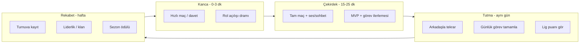

# Vampir Köylü — Oyuncu Tutma ve Rekabet Stratejisi

**Sürüm:** 1.0  
**Tarih:** Mayıs 2026  
**Kapsam:** Ürün + oyun tasarımı + teknik yol haritası (18 ay)  
**Kaynak:** Canlı kod (`server/src`, `mobile/lib`), `GAME_RULES.md`, `roles.js`, `roomStore.js`, `progression.js`, `engagement.js`, `tournaments.js`

---

## 0. Yönetici özeti

Vampir Köylü, **sosyal dedüksiyon** oyunudur: gizli roller, gece/gündüz fazları, oylama ve sohbet/ses ile kazanma. Oyuncuyu tutmanın ana kaldıracı **“bir sonraki el”** hissidir; rekabetin ana kaldıracı **görünür statü** (lig, kupa, arkadaş sıralaması) ve **anlık gerilim** (MVP, seri galibiyet, turnuva ödülü) olmalıdır.

**Kritik gerçek (kod analizi):** 12 rol tanımlı; online’da yalnızca **vampir öldürme + doktor koruma + gündüz oyu** çalışıyor. Gözcü, avcı, muhafız vb. ataniyor ama oynanmıyor. Bu, deneyimi “basit vampir-köylü”ye indirger ve uzun vadede **tekrar oynama motivasyonunu** zayıflatır. Tutma planının **Faz 0 önceliği**, rol derinliğini tamamlamaktır; rekabet planı bunun üzerine inşa edilmelidir.

**Hedef metrikler (12. ay):**

| Metrik | Tanım | Hedef |
|--------|--------|-------|
| D1 retention | Kayıt sonrası ertesi gün giriş | ≥ %35 |
| D7 retention | 7. gün aktif | ≥ %18 |
| D30 retention | 30. gün aktif | ≥ %8 |
| Günlük maç / aktif kullanıcı | DAU başına tamamlanan online maç | ≥ 1,4 |
| Haftalık turnuva kayıt oranı | Gold+ oyuncuların %’si | ≥ %25 |
| Arkadaşlı maç oranı | Maçlarda ≥1 arkadaş olan oturum | ≥ %40 |
| Ortalama oturum süresi | Uygulama foreground | ≥ 22 dk |

---

## 1. Oyun nasıl oynanır? (Araştırma özeti)

### 1.1 Tür ve çekirdek döngü

**Tür:** Werewolf / Mafia tarzı **gizli rol + tartışma + oylama**.  
**Çekirdek döngü (online, sunucu otoriter — `roomStore.js`):**

```
Lobi → Hazır → Başlat → [Gece → Gündüz oyu → Kazanan?]×N → Maç özeti → Ödül
```

| Faz | Oyuncu ne yapar | Sunucu ne yapar |
|-----|------------------|-----------------|
| **Lobi** | Oda kodu / hızlı maç, hazır, bot doldur | `room:ready`, `room:start`, min 4–6 oyuncu |
| **Gece** | Vampir: hedef; Doktor: koruma | `night_kill`, `doctor_protect` → `resolveNight` |
| **Gündüz** | Tartışma (sohbet/ses) + oylama | `day_vote` → `resolveDay` |
| **Bitiş** | Özet ekranı | `winner`: `villager` veya `vampire`; coin/XP/MVP |

**Kazanma (`checkWinner`):**

- Tüm kötü (vampir takımı) ölürse → **Köylü** kazanır.
- Kötü sayısı ≥ iyi sayısı → **Vampir** kazanır (`fool` iyi sayıma dahil).

### 1.2 Roller (tasarım vs gerçek)

`roles.js` — oyuncu sayısına göre dağılım:

| Kişi | Örnek roller |
|------|----------------|
| 4–5 | Vampir, doktor, gözcü + köylü |
| 6 | + avcı, şerif |
| 7–8 | Sessiz katil, muhafız, büyücü; 8’de çift ajan, lanetli köylü, aptal |

**Online’da işleyen gece/gündüz aksiyonları:** `night_kill`, `doctor_protect`, `day_vote` (+ `deception` log, oyun durumunu değiştirmiyor).

**Henüz işlenmeyen (atanıyor, oynanmıyor):** gözcü araştırma, avcı tuzak, muhafız, şerif, büyücü, çift ajan, aptal zaferi vb.

### 1.3 İletişim kanalları (sosyal gerilim)

`chatChannels.js` mantığı:

- `room:CODE` — canlılar
- `dead:CODE` — ölüler (bilgi asimetrisi)
- `vampire:CODE` — gece, yalnızca kötü takım
- `general` — lobi hub
- `dm:*` — özel mesaj (oturum/ephemeral)
- **Ses:** WebRTC (`voice_rtc_manager.dart`), yakınlık/genel mod

Sohbet ve ses, bu türde **oyunun yarısıdır**; tutma planında “sosyal baskın” metrikleri zorunludur.

### 1.4 Modlar

| Mod | Giriş | İlerleme | Rekabet |
|-----|--------|----------|---------|
| **Online** | Kayıt + socket | Coin, XP, rütbe, görev, turnuva | Evet |
| **Solo / offline** | Misafir | Yok (sunucu ödülü yok) | Hayır |
| **Hızlı maç** | Ana sayfa | Botlu oda, hızlı başlat | Düşük (eğitim/ısınma) |

Solo, **kayıt hunisine** hizmet eder; asıl tutma ve rekabet **online** üzerindedir.

### 1.5 Mevcut ilerleme ve rekabet altyapısı

**Ekonomi (`progression.js`):** coin, XP, 6 rütbe (Bronz → Ölümsüz Vampir), maç girişi/sonu ödülü, MVP bonusu, Silver+ %5 coin.

**Günlük tutma (`engagement.js`):** günlük giriş (+100 coin), günlük/haftalık görevler, sezon pass (5 kademe, aylık), referral (+30/+30 coin).

**Rekabet:** XP/galibiyet liderlik tablosu; turnuva (Haftalık Köylü Kupası, Altın Lig); arkadaş + oda daveti; canlı istatistik (`live:stats`).

**Eksikler (rekabeti sınırlayan):** turnuva tek maç (bracket yok), rol tercihi ücretli ama uygulanmıyor, orta maç reconnect yok, FCM/push gerçek değil, çoğu rol pasif.

---

## 2. Oyuncu psikolojisi — Neden kalır, neden rekabet eder?

### 2.1 Tutma için dört motivasyon

1. **Belirsizlik ve dram** — “Bu gece kimi öldürdüler?” Her el farklı rol = farklı hikâye.
2. **Sosyal itibar** — Masada doğru konuşmak, MVP, liderlik sırası.
3. **İlerleme hissi** — Coin → kozmetik; XP → rütbe; sezon → kademe.
4. **Rutin + FOMO** — Günlük bonus, haftalık kupa, sezon bitişi.

### 2.2 Rekabet için üç motivasyon

1. **Karşılaştırılabilir statü** — Lig, ELO, kupa, arkadaş sıralaması.
2. **Anlık zafer** — Maç sonu MVP, seri galibiyet rozeti.
3. **Kayıp korkusu (kontrollü)** — Lig düşüşü, turnuva elemeleri (adil kurallarla).

### 2.3 Bu oyunda kaçınılması gerekenler

- **Pay-to-win** — Rank/coin ile oyun gücü satmak (katalog `cosmeticOnly: true` — korunmalı).
- **Boş ödül** — Coin birikip harcanmıyorsa tutma düşer → kozmetik + turnuva + sezon döngüsü şart.
- **Adaletsiz maç** — Host çıkışı, kopma, bot dengesizliği güveni öldürür (kısmen iade var; reconnect şart).

---

## 3. Stratejik hedef: “Sürekli oynama” döngüsü

Aşağıdaki döngü, tüm özelliklerin hizalanacağı ana modeldir:



**Ürün ilkesi:** Her oturum sonunda oyuncuya **tek net CTA** göster:

- “Arkadaşını davet et — +1 maç görevi”
- “Cuma 21:00 Köylü Kupası — 3 yer kaldı”
- “Sezon 4’e 120 XP — 1 maç yeter”

---

## 4. Rekabet mimarisi (katmanlı)

### 4.1 Katman 1 — Mikro rekabet (maç içi / maç sonu)

| Özellik | Açıklama | Teknik not |
|---------|----------|------------|
| **MVP sistemi** | Var (`matchLog.js`) — UI’da güçlendir | Maç özeti: “Bu gece en çok etki” |
| **Rol başarı rozeti** | Doktor kurtardı, gözcü doğru buldu | Görev metrikleri + yeni rozetler |
| **Anlık seri** | 3 galibiyet → profil çerçevesi 24s | `win_streak` profil alanı |
| **Ölü sohbet + hayalet ipucu** | Ölüler bilgi taşır (kontrollü) | `dead:CODE` zaten var |

### 4.2 Katman 2 — Sosyal rekabet (arkadaş / oda)

| Özellik | Açıklama | Durum |
|---------|----------|--------|
| Arkadaş daveti | `room:invite` + push | Kısmen — FCM gerekli |
| Arkadaş lig tablosu | Sadece arkadaşlar XP sırası | **Yeni** |
| Özel oda “rekabet modu” | Aynı grupta ELO | **Yeni** |
| Haftalık “ekip” görevi | 3 arkadaşla 5 maç | **Yeni** |

### 4.3 Katman 3 — Yapısal rekabet (lig + turnuva)

**A. Gizli ELO / Lig puanı (önerilen çekirdek)**

- Her online maç sonrası ± puan (takım sonucu + MVP + terk cezası).
- 10 lig: Bronz III → Ölümsüz I (görsel `kRankThemes` ile uyumlu).
- **Promotion series:** 3 maçta 2 galibiyet yükselme (LoL tarzı, bağımlılık yaratır).
- Sezon reset: 3 ayda bir yumuşak reset (%70 koruma).

**B. Turnuva evrimi (mevcut → hedef)**

| Aşama | Mevcut | Hedef |
|-------|--------|--------|
| v1 | Tek lobide tek maç, havuz kazanan | Haftalık Köylü Kupası (koru) |
| v2 | — | 8/16 kişi **tek eleme bracket** (sunucu eşleştirme) |
| v3 | — | Altın Lig: çoklu tur, canlı skor tablosu |
| v4 | — | Sezon finalleri (top 64), özel kozmetik |

**C. Liderlik tablosu genişletme**

- Global XP (var)
- Global galibiyet (var)
- **Haftalık lig** (yeni)
- **Bölgesel** (TR saat dilimi haftası — yeni)
- **Rol uzmanlığı** (“En iyi Doktor” — yeni, rol metrikleri şart)

### 4.4 Katman 4 — Meta rekabet (sezon / topluluk)

- **Aylık sezon teması** — Rol ve kozmetik teması (ör. “Kış Sarayı”)
- **Sezon pass** — Ücretsiz + premium; görev XP ile kademe (var, güçlendir)
- **Topluluk hedefi** — “Bu hafta 10.000 maç” → herkese coin
- **Canlı etkinlik** — Cuma 21:00 double XP (sunucu `publicConfig`)

---

## 5. Tutma planı — Fazlar (18 ay)

### Faz 0 — Oyun bütünlüğü (Ay 1–2) — ÖNCELİK KRİTİK

**Amaç:** “Rol oyunu” vaadini tutmak; aksi halde rekabet anlamsız.

| # | İş | Etki |
|---|-----|------|
| 0.1 | Gözcü/şerif `investigate` — hedef rol ipucu (sunucu doğrulu) | Derinlik |
| 0.2 | Avcı `trap` — saldırgana geri vuruş | Gerilim |
| 0.3 | Muhafız `guard` — bir gece blok | Dengelenmiş köy |
| 0.4 | Aptal `fool` — yanlış elenince nötr zafer | Sürpriz |
| 0.5 | Çift ajan `deceive` — mobil UI + metrik | Görev + sosyal |
| 0.6 | **Mid-game reconnect** (90 sn pencere, aynı slot) | Güven, D7 |
| 0.7 | Maç sonu “rol özeti” kartı paylaşımı | Viral |

**KPI:** Maç tamamlama oranı +%15; “rolüm işe yaramadı” geri bildirimi −%50.

---

### Faz 1 — Günlük alışkanlık (Ay 2–4)

**Amaç:** Her gün 1–2 maç rutini.

| # | Özellik | Detay |
|---|---------|--------|
| 1.1 | **Giriş zinciri** | 7 günlük takvim (gün 7’de kozmetik parçası) |
| 1.2 | **Görev çeşitliliği** | Rol bazlı günlük (“1 gece koru”, “1 doğru oy”) |
| 1.3 | **Hızlı maç 2.0** | Eğitim modu: ilk 3 maçta ipucu banner |
| 1.4 | **Push (FCM)** | Davet, günlük bonus, turnuva 1 saat önce |
| 1.5 | **Ana sayfa “Sıradaki hedef”** | Tek satır: görev / sezon / kupa |
| 1.6 | **Misafir → kayıt** | 2. maçta “ilerlemen kaydedilsin” modal (var, A/B test) |

**KPI:** D1 +%5, günlük görev tamamlama %40+.

---

### Faz 2 — Sosyal yapışkanlık (Ay 4–7)

**Amaç:** Arkadaşsız maç oranını düşürmek.

| # | Özellik | Detay |
|---|---------|--------|
| 2.1 | Arkadaş lig tablosu | Haftalık reset, sadece arkadaş XP |
| 2.2 | “Son oynadıkların” | Son 5 masadan tek tık davet |
| 2.3 | Klan / ekip (8 kişi) | Ortak haftalık görev, klan rozeti |
| 2.4 | Ölüler + canlılar “tribün” | Seyirci modu (ölü, maç bitene kadar) |
| 2.5 | Ses kalitesi + TURN prod | `publicConfig` TURN; kopma UX |
| 2.6 | Raporlama + moderasyon 2.0 | Otomatik timeout, tekrarlayan rapor |

**KPI:** Arkadaşlı maç %40+; davet kabul oranı %25+.

---

### Faz 3 — Yapısal rekabet (Ay 7–12)

**Amaç:** “Ciddi oyuncu” segmenti ve monetizasyon (adil).

| # | Özellik | Detay |
|---|---------|--------|
| 3.1 | **Lig / ELO sistemi** | 10 kademe, promotion series, sezon reset |
| 3.2 | **Turnuva bracket** | 8 kişi tek eleme; sunucu `tournament_bracket` tablosu |
| 3.3 | **Rol tercihi gerçek** | Ücret karşılığı havuzda öncelik (adil cap) |
| 3.4 | **Haftalık Köylü Kupası** | Cuma 21:00 TR; kayıt push |
| 3.5 | **Altın Lig** | Gold+; IAP/bakiye; çok turlu |
| 3.6 | **Liderlik genişletme** | Haftalık lig, rol uzmanlığı |
| 3.7 | **Play Billing tam** | `payments.js` gerçek verify |
| 3.8 | **Ödüllü reklam (opsiyonel)** | Ekstra günlük coin, kozmetik düşürme hızlandırma — P2W yok |

**KPI:** D7 +%3; turnuva kayıt Gold+ %25; IAP dönüşüm %2–4 (kozmetik + sezon).

---

### Faz 4 — Ekosistem ve marka (Ay 12–18)

| # | Özellik | Detay |
|---|---------|--------|
| 4.1 | Sezon finalleri | Top 64 bracket, Twitch/YouTube entegrasyonu |
| 4.2 | İçerik üretici kodu | Referral geliştirilmiş (% pay) |
| 4.3 | Özel etkinlik modu | “Hızlı gece” (5 dk gece), “Kaos” (çift vampir garanti) |
| 4.4 | iOS + cross-play | Pazar genişleme |
| 4.5 | Anti-smurf | Yeni hesap lig kısıtı, cihaz parmak izi hafif |
| 4.6 | Topluluk oylaması | Sonraki rol / kozmetik oylaması |

---

## 6. Ekonomi ve rekabet dengesi

### 6.1 Coin akışı (oyuncuyu masada tut)

```
Giriş: günlük +100, maç giriş +8, görev, referral
Çıkış: kozmetik, turnuva kayıt, sezon premium (10 balance), rol tercih ücreti
```

**Kural:** Ortalama oyuncu haftada **2 turnuva** veya **1 premium kozmetik** alabilmeli — aksi “fakir hissi” yaratır.

### 6.2 Rütbe avantajları (mevcut + öneri)

| Rütbe | Mevcut / öneri | Rekabet etkisi |
|-------|----------------|----------------|
| Silver+ | +%5 maç coin | Ekonomi, oyun gücü yok |
| Gold+ | Turnuva erişimi | Segmentasyon |
| Platinum+ | **Öneri:** özel lig rozeti | Statü |
| Diamond+ | **Öneri:** sezon finalesi ön eleme | Prestij |

### 6.3 Turnuva ödül matematiği (örnek)

**Haftalık Köylü Kupası:** 8 oyuncu × 50 coin kayıt = 400 havuz  
- 1.: %50 (200)  
- 2.: %25 (100)  
- 3.–4.: %12.5 (50)  
- Platform: %0 (tutma odaklı) veya %10 sink

**Altın Lig:** IAP giriş → kozmetik + coin karışık (şeffaf tablo).

---

## 7. İçerik ve canlı operasyon takvimi

| Gün | Etkinlik | Push / banner |
|-----|----------|----------------|
| Pazartesi | “Haftalık görev yenilendi” | Evet |
| Çarşamba | Double maç XP (18:00–22:00) | Evet |
| Cuma 21:00 | Köylü Kupası | 1 saat + 15 dk önce |
| Ayın 1’i | Sezon pass yeni kademe | Evet |
| Ayın son 3 gün | Sezon bitiş FOMO | Agresif (günde max 1) |

**A/B test alanları:** giriş zinciri vs tek günlük bonus; hızlı maç bot zorluğu; MVP bonus miktarı.

---

## 8. Teknik bağımlılık matrisi

| Özellik | Bağımlılık | Dosya / alan |
|---------|------------|--------------|
| Rol derinliği | `gameAction` genişletme | `roomStore.js`, `online_room_screen.dart` |
| Lig/ELO | Yeni tablolar + maç sonu hook | `progression.js`, migration |
| Bracket turnuva | State machine | `tournaments.js`, yeni `bracket.js` |
| Push | FCM + `push-token` | `deploy/FCM-KURULUM.md`, `engagement.js` |
| Reconnect | Socket userId ↔ player slot | `roomStore.js` `joinRoom` |
| Arkadaş lig | Haftalık snapshot | `engagement.js` |
| Anti-cheat lig | Rate limit, terk cezası | `roomStore.js` host leave |

---

## 9. Ölçüm ve analitik

### 9.1 Olaylar (client + server)

- `match_start`, `match_end` (winner, role, mvp, duration, player_count, bots)
- `quest_claim`, `daily_claim`, `tournament_register`, `tournament_win`
- `friend_invite_sent`, `friend_invite_accepted`
- `chat_message_sent`, `voice_joined`
- `session_start`, `session_end`, `room_leave_reason`

### 9.2 Kohort panoları

- Kayıt haftasına göre D1/D7/D30
- İlk maç modu: hızlı maç vs arkadaş odası
- Lig kademesine göre churn

### 9.3 Alarm eşikleri

- Maç tamamlama < %70 → bot/lobi sorunu
- Host leave > %5 maç → ceza/UX
- Ortalama bekleme > 90 sn → matchmaking

---

## 10. Riskler ve önlemler

| Risk | Önlem |
|------|--------|
| Rol karmaşıklığı yeni oyuncuyu korkutur | Hızlı maç + 4–5 kişilik “basit mod” |
| Lig kaygısı casual’ı kaçırır | “Derecesiz casual” kuyruk + ayrı lig |
| Pay-to-win algısı | Kozmetik-only; turnuva skill-based |
| Toxic sohbet | Mute, rapor, otomatik filtre (var) |
| Sunucu kopması | Reconnect Faz 0 |
| Sahte hesap smurf | Lig kayıt minimum 10 maç |

---

## 11. 90 günlük uygulama sırası (özet backlog)

**Ay 1:** Faz 0.1–0.3 (gözcü, avcı, muhafız) + reconnect tasarım  
**Ay 2:** Faz 0.4–0.7 + FCM + giriş zinciri  
**Ay 3:** Arkadaş lig + görev çeşitliliği + turnuva bracket v1  
**Ay 4–6:** Lig/ELO + Altın Lig çok tur + liderlik genişletme  
**Ay 7–12:** Klan, sezon finalleri, etkinlik modları  

Detaylı sprint maddeleri için: `docs/GELISTIRME-PLANI.md` ile senkronize edin; bu belge **strateji**, GELISTIRME-PLANI **sürüm teslimatı** içindir.

---

## 12. Başarı kriteri (tek cümle)

Oyuncu uygulamayı kapattığında şunu düşünmeli: **“Yarın akşam arkadaşlarımla bir el daha, Cuma kupasında lig puanımı yükseltirim.”**  
Teknik ekip bunu ölçülebilir kılar: **arkadaşlı maç oranı**, **haftalık turnuva katılımı**, **D7 retention**.

---

*Bu plan, mevcut `PLAN-RETENTION-v0.2.14.md` (Faz A–E tamamlandı) üzerine kuruludur ve bir sonraki büyüme dalgasını tanımlar.*
